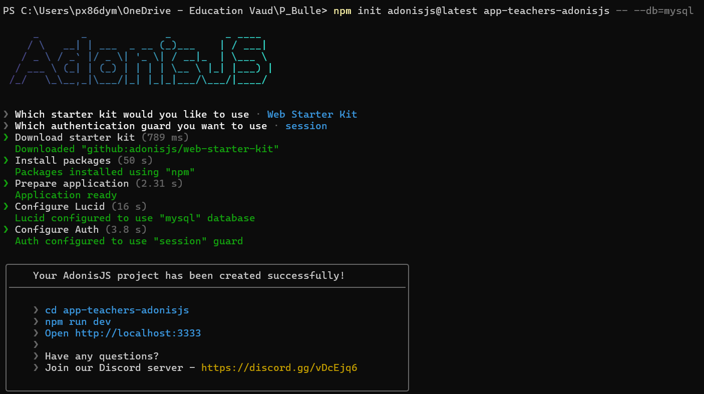
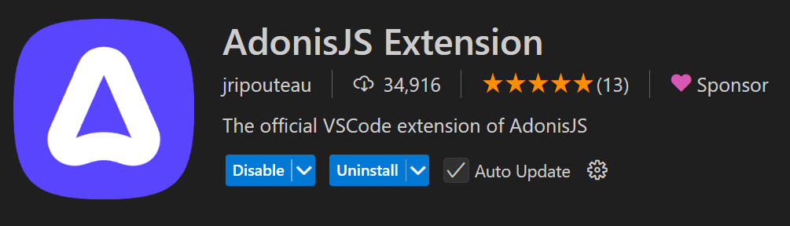
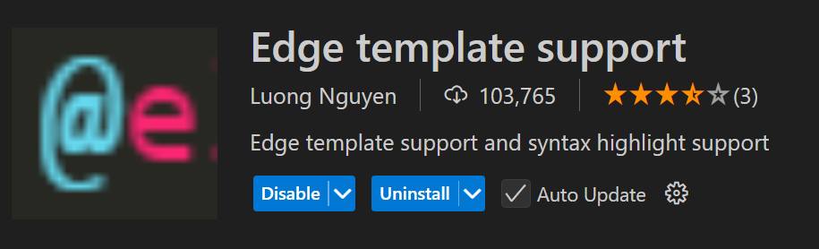
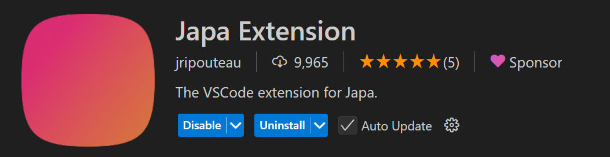

# Application des surnoms des enseignants avec AdonisJS

## Générer le projet de départ - Step 0

Dans cet étape, nous avons simplement exécuter la commande initiale qui permet de générer un projet AodnisJS.

```bash
npm init adonisjs@latest app-teachers-adonisjs -- --db=mysql
```

`app-teachers-adonisjs` est le nom du projet.

`--db=mysql` permet d'indiquer le SGBDR souhaité, dans notre cas MySQL.

Le kit de démarrage (Starter kit) nous demande de choisir entre différentes options.

Il est important de choisir :

- Web Starter Kit
- session

comme ci-dessous :



## Installation des extensions de vscode

Nous allons installer 3 extensions :

- AdonisJS Extension



- Edge template



- Test runner Japa (facultatif)



## Prochaine étape

Dans la prochaine étape <a href="https://github.com/GregLeBarbar/app-teachers-adonisjs/tree/step1">step1</a>, nous allons modifier la vue `home` et gérer les fichiers statiques CSS et JS.
