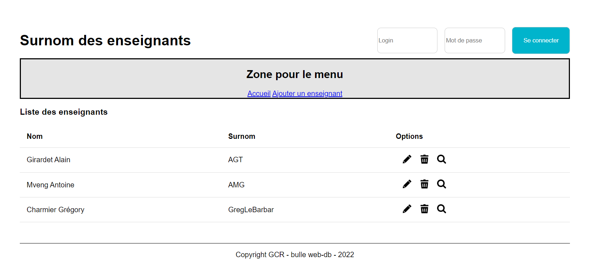

# Modification de la vue home - Step1

Dans cette étape, nous allons travailler dans une vue (le V du pattern MVC).

## Qu'est qu'une vue ?

Une vue est un fichier qui contient du HTML combiné avec des balises dynamiques pour insérer des données générées par le serveur.
Ces fichiers sont généralement gérés par un moteur de templates, tel que Edge dans AdonisJS.

## Version statique

Pour commencer cette aventure avec le framework AdonisJS, nous allons récupérer la <a href="https://github.com/GregLeBarbar/application-surnoms-version-statique">Version statique HTML5 / CSS3</a> de l'application des surnoms des enseignants.

## Fichier css

Nous allons copier le contenu du fichier 'style.css' de l'application statique pour le coller dans le fichier 'app.css' présent dans 'resources/css'.

## Modifier la vue 'home'

Nous allons modifier la vue `home.edge` pour copier/coller le html présent dans le fichier 'index.html' de la version statique.

## Import des fichiers statiques css et js

Dans la balise `head` nous allons remplacer la ligne

```html
<link href="./css/style.css" rel="stylesheet" />
```

par

```edge
@vite(['resources/css/app.css', 'resources/js/app.js'])
```

afin d'importer les fichiers statiques.

La directive `@vite` gère automatiquement l'inclusion des scripts nécessaires, que ce soit en mode développement avec le serveur `Vite` ou en production avec les fichiers compilés.

## Images

Dans la version statique de l'application, il y a quelques icônes présents dans le répertoire `img/`.

Dans notre projet AdonisJS, nous allons créer un répertoire `public/` et copier le répertoire `img/` à l'intérieur.

## Etat de l'application à la fin de cette étape

Notre application a pour l'instant qu'une page à savoir la homepage.
De plus, pour l'instant tout est statique.



Dans la prochaine étape <a href="https://github.com/GregLeBarbar/app-teachers-adonisjs/tree/step2">step2</a>, nous allons découvrir plus en détail le gestionnaire de template d'AdonisJS : <a href="https://edgejs.dev/docs/introduction">EDGE</a>.
