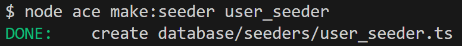

# Application des surnoms des enseignants avec Adonis - Step10

Pour mettre en place l'authentification, nous allons commencer par mettre à jour la table `t_user` MySQL.

Cette dernière existe car une migration par défaut nous est offerte par AdonisJS. Mais les champs de la table ne correspondent pas à nos besoins.

## Migration User

Voilà le code de la migration `*_create_users_table.ts`.

```js
import { BaseSchema } from '@adonisjs/lucid/schema'

export default class extends BaseSchema {
  protected tableName = 't_user'

  async up() {
    this.schema.createTable(this.tableName, (table) => {
      table.increments('id').notNullable()
      table.string('username').notNullable().unique()
      table.string('password').notNullable()
      table.boolean('is_admin').notNullable().defaultTo(false)
      table.timestamp('created_at').notNullable()
      table.timestamp('updated_at').nullable()
    })
  }

  async down() {
    this.schema.dropTable(this.tableName)
  }
}
```

## Seeder pour les utilisateurs

Nous allons créer 2 utilisateurs, un avec les droits admin et l'autre sans.



```js
import User from '#models/user'
import { BaseSeeder } from '@adonisjs/lucid/seeders'

export default class extends BaseSeeder {
  async run() {
    // Création de users
    await User.createMany([
      { username: 'Albert', password: 'user', isAdmin: false },
      { username: 'Edouard', password: 'admin', isAdmin: true },
    ])
  }
}
```

## Mise à jour des tables

> Exercice :
> A vous de supprimer les tables, réexécuter les migrations puis réexécuter les seeders et le factories.

Solution :

`node ace migration:fresh --seed`

A noter que ce n'est pas exactement la même commande que lors de l'étape 5

## Modèle User

```js
import { DateTime } from 'luxon'
import hash from '@adonisjs/core/services/hash'
import { compose } from '@adonisjs/core/helpers'
import { BaseModel, column } from '@adonisjs/lucid/orm'
import { withAuthFinder } from '@adonisjs/auth/mixins/lucid'

const AuthFinder = withAuthFinder(() => hash.use('scrypt'), {
  uids: ['username'],
  passwordColumnName: 'password',
})

export default class User extends compose(BaseModel, AuthFinder) {
  // Renommer le nom de la table pour respecter les conventions de nommage de l'ETML
  public static table = 't_user'

  @column({ isPrimary: true })
  declare id: number

  @column()
  declare username: string

  @column({ serializeAs: null })
  declare password: string

  @column()
  declare isAdmin: boolean

  @column.dateTime({ autoCreate: true })
  declare createdAt: DateTime

  @column.dateTime({ autoCreate: true, autoUpdate: true })
  declare updatedAt: DateTime | null
}
```

## Prochaine étape

Dans la prochaine étape <a href="https://github.com/GregLeBarbar/app-teachers-adonisjs/tree/step11">step11</a>, nous allons mettre en place le login.
