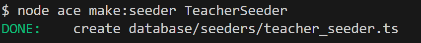
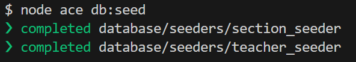
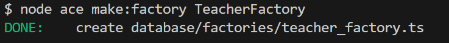
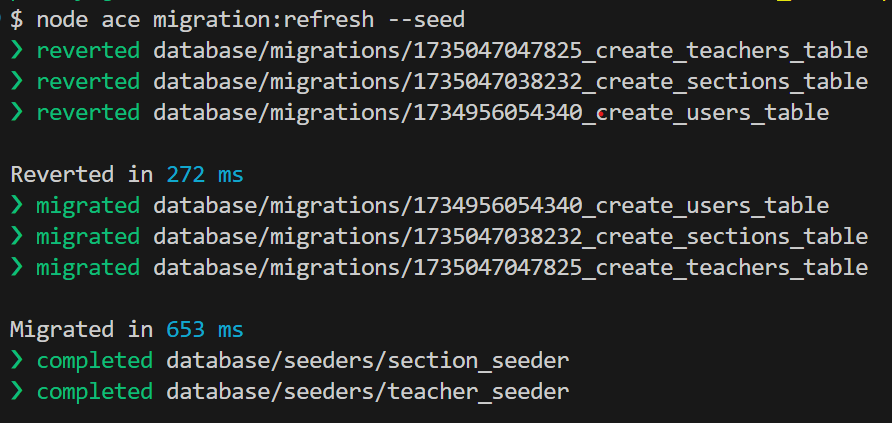
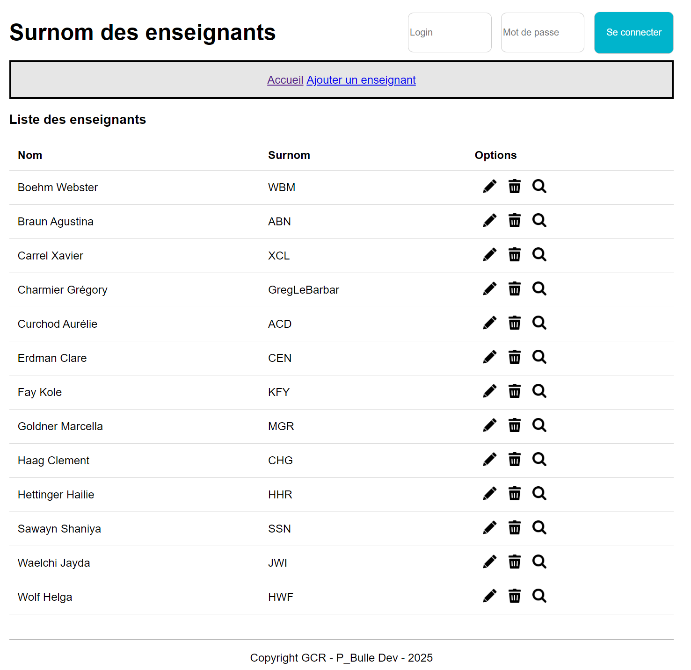

# Application des surnoms des enseignants avec Adonis - Step5

## Créer un jeu de données

Dans cette étape, nous allons apprendre à créer un jeu de données à l'aide de `seeder` et de `factory`.

## Qu'est ce qu'un seeder ?

Un `seeder` est un script qui insère des données initiales ou fictives dans une base de données.

Il est utilisé pour :

- Peupler une base de données avec des données de démarrage (par exemple, rôles d'utilisateur, paramètres système).
- Créer des données pour le développement (par exemple, utilisateurs fictifs, produits de test).
- Faciliter les tests automatisés en configurant des données prédictibles.

## Créer les seeders à l'aide du CLI

Nous allons créer un seeder pour les section et un autre pour les enseignants :



Pour le fichier `section_seeder.ts` :

```js
import { BaseSeeder } from '@adonisjs/lucid/seeders'
import Section from '#models/section'

export default class extends BaseSeeder {
  async run() {
    // Création de sections
    await Section.createMany([
      { id: 1, name: 'Informatique' },
      { id: 2, name: 'Electronique' },
      { id: 3, name: 'Automatique' },
      { id: 4, name: 'Bois' },
      { id: 5, name: 'Mécatronique' },
      { id: 6, name: 'Polymécanique' },
    ])
  }
}
```

Pour le fichier `teacher_seeder.ts` :

```js
import { BaseSeeder } from '@adonisjs/lucid/seeders'
import Teacher from '#models/teacher'

export default class extends BaseSeeder {
  async run() {
    // Création d'enseignants
    await Teacher.createMany([
      {
        gender: 'M',
        firstname: 'Grégory',
        lastname: 'Charmier',
        nickname: 'GregLeBarbar',
        origine: "Plateforme de jeux d'échecs",
        sectionId: 1,
      },
      {
        gender: 'M',
        firstname: 'Xavier',
        lastname: 'Carrel',
        nickname: 'XCL',
        origine: 'Sigle ETML',
        sectionId: 1,
      },
      {
        gender: 'W',
        firstname: 'Aurélie',
        lastname: 'Curchod',
        nickname: 'ACD',
        origine: 'Sigle ETML',
        sectionId: 1,
      },
    ])
  }
}
```

## Exécuter le seeder

Exécuter les seeders afin de générer les données



## Qu'est ce qu'une factory ?

Une factory (ou fabrique en français) est un outil utilisé dans le développement logiciel pour générer automatiquement des données fictives (dummy data) ou des données d'exemple.

Dans le contexte d'AdonisJS et des bases de données, une factory est utilisée pour :

- Créer des objets ou des modèles avec des données cohérentes et réalistes.
- Remplir la base de données avec des enregistrements pour les tests ou le développement local.
- Automatiser la création d'entités comme des utilisateurs, des produits, des commandes, etc.

## Création d'un factory pour les enseignants via le CLI



On modifie le fichier `teacher_factory.ts` :

```js
import factory from '@adonisjs/lucid/factories'
import Teacher from '#models/teacher'

export const TeacherFactory = factory
  .define(Teacher, async ({ faker }) => {
    const firstname = faker.person.firstName() // Génère un prénom réaliste
    const lastname = faker.person.lastName() // Génère un nom de famille réaliste
    return {
      firstname: firstname,
      lastname: lastname,
      nickname: `${firstname.charAt(0)}${lastname.charAt(0)}${lastname.slice(-1)}`, // Génère un surnom
      gender: faker.helpers.arrayElement(['M', 'F', 'O']), // Génère un genre aléatoire
      origine: faker.lorem.word(4), // Génère 4 mots aléatoires
      sectionId: faker.number.int({ min: 1, max: 6 }), // ID de section aléatoire
    }
  })
  .build()
```

Il faut maintenant appeler `TeacherFactory` dans le `seeder` des enseignants.

```js
import { TeacherFactory } from '#database/factories/teacher_factory'
import { BaseSeeder } from '@adonisjs/lucid/seeders'
import Teacher from '#models/teacher'

export default class extends BaseSeeder {
  async run() {
    // Création d'enseignants
    await Teacher.createMany([
      {
        gender: 'M',
        firstname: 'Grégory',
        lastname: 'Charmier',
        nickname: 'GregLeBarbar',
        origine: "Plateforme de jeux d'échecs",
        sectionId: 1,
      },
      ...
    ])

    // Appel la factory pour créer 10 enseignants
    await TeacherFactory.createMany(10)
  }
}
```

Maintenant nous devons exécuter les seeders pour exécuter la factory.

Pour cela, nous devons supprimer puis recréer toutes les tables puis exécuter les factories et les seeders.

Nous pouvons faire cela en seulement une commande !



## Etat de l'application à la fin de cette étape

Notre application a toujours qu'une page à savoir la homepage.



Dans la prochaine étape <a href="https://github.com/GregLeBarbar/app-teachers-adonisjs/tree/step6">step6</a>, nous allons afficher les détails d'un enseignant.
