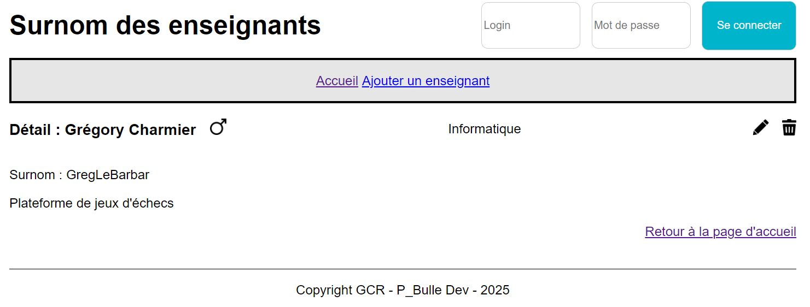

# Application des surnoms des enseignants avec Adonis - Step6

Pour pouvoir afficher les détails d'un enseignant, nous allons devoir :

- créer une route
- ajouter une méthode au contrôleur
- ajouter une vue

## Route

Dans le fichier `routes.ts`:

```js
// Route permettant de voir les détails d'un enseignant
router.get('/teacher/:id/show', [TeachersController, 'show']).as('teacher.show')
```

A noter le nom de la route `teacher.show`.

## Contrôleur

Dans le contrôleur `teachers_controller.ts` :

```js
  /**
   * Afficher les détails d'un enseignant (y compris le nom de sa section)
   */
  async show({ params, view }: HttpContext) {
    // Sélectionner l'enseignant dont on veut afficher les détails
    // On veut également pouvoir afficher la section de l'enseignant
    const teacher = await Teacher.query().where('id', params.id).preload('section').firstOrFail()

    // Afficher la vue
    return view.render('pages/teachers/show.edge', { title: "Détail d'un enseignant", teacher })
  }
```

## Vue

Nous devons créer la vue `show.edge`

```js
@component('components/layout', { title: title })
  <div class="user-head">
    <h3>
      Détail : {{ teacher.firstname }} {{ teacher.lastname }}
        
    </h3>
    <p>
      {{ teacher.section.name }}
    </p>
    <div class="actions">
      <a href="#">
        
      </a>
      <a href="#">
        
      </a>
    </div>
  </div>
  <div class="user-body">
    <div class="left">
      <p>
        Surnom : {{ teacher.nickname }}
      </p>
      <p>
        {{ teacher.origine }}
      </p>
    </div>
  </div>
  <div class="user-footer">
    <a href="{{ route('home') }}">Retour à la page d'accueil</a>
  </div>
@endcomponent

```

## Modifier la homepage

Dans la homepage, nous devons mettre à jour le lien pour afficher les détails d'un enseignant.

```edge
<a href="{{ route('teacher.show', {id: teacher.id}) }}">
  
</a>
```

## Etat de l'application à la fin de cette étape



Dans la prochaine étape <a href="https://github.com/GregLeBarbar/app-teachers-adonisjs/tree/step7">step7</a>, nous allons gérer la suppression d'un nouvel enseignant.
