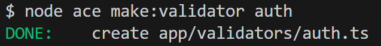
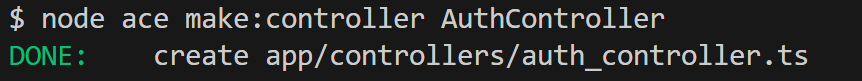

# Application des surnoms des enseignants avec Adonis - Step11

Nous allons mettre en place le login.

pour cela, nous avons besoin :

- d'une nouvelle route
- d'un nouveau contrôleur et d'une méthode dans ce contrôleur
- d'un validateur

## Routes

```js
// Route permettant de se connecter
router.post('/login', [AuthController, 'handleLogin']).as('auth.handleLogin')
```

## Validateur

Création du validateur via le CLI :



Le code du validateur `app/validators/auth.ts`:

```js
import vine from '@vinejs/vine'

const loginUserValidator = vine.compile(
  vine.object({
    username: vine.string(),
    password: vine.string().minLength(4),
  })
)

export { loginUserValidator }
```

## Contrôleur AuthController

Création du contrôleur via le CLI :



```js
import type { HttpContext } from '@adonisjs/core/http'
import { loginUserValidator } from '#validators/auth'
import User from '#models/user'

/**
 * Controller pour l'authentification
 */
export default class AuthController {
  /**
   * Gérer la connexion d'un utilisateur
   */
  async handleLogin({ request, auth, session, response }: HttpContext) {
    // Récupère les données validées
    const { username, password } = await request.validateUsing(loginUserValidator)

    // Récupère l'utilisateur correspondant aux données saisies par l'utilisateur
    const user = await User.verifyCredentials(username, password)

    // Utilise le guard 'web' pour connecter l'utilisateur -> Voir le fichier config/auth.ts
    await auth.use('web').login(user)

    // Affiche un msg à l'utilsateur
    session.flash('success', "L'utilisateur s'est connecté avec succès")

    // Redirige vers la route ayant pour nom 'home'
    return response.redirect().toRoute('home')
  }

}
```

## Bouton 'Se connecter' et 'Se déconnecter'

Dans le fichier `header.edge` nous allons ajouter un bouton "Se déconnecter" ainsi que l'affichage du username de l'utilisateur connecté.

```edge
@eval(await auth.check())
<header>
  <div class="container-header">
    <div class="titre-header">
      <h1>
        Surnom des enseignants
      </h1>
    </div>
    <div class="login-container">
      @if(auth.isAuthenticated)
        {{ auth.user.username }} ({{ auth.user.isAdmin  ? 'admin' : 'user' }})
        <form action="#" method="post">
          {{ csrfField() }}
        <button type="submit" class="btn btn-logout">Se déconnecter</button>
        </form>
      @else
        <form action="{{ route('auth.handleLogin') }}" method="post">
          {{ csrfField() }}
          @!component('components/input', { name: 'username', label: "Nom d'utilisateur"})
          @!component('components/input', { name: 'password', label: 'Mot de passe', type: 'password'})
          <button type="submit" class="btn btn-login">Se connecter</button>
        </form>
      @endif
    </div>
  </div>
  <nav>
    <a href="{{ route('home') }}">Accueil</a>&nbsp;
    <a href="{{ route('teacher.create') }}">Ajouter un enseignant</a>
  </nav>
</header>
```

## Utilisateur inconnu

Si l'utilisateur saisit des mauvaises informations de connexion, il est important de lui afficher un message d'erreur.

Ajouter ce code au fichier `views/partials/flash.edge`

````edge
@error('E_INVALID_CREDENTIALS')

  <div class="alert alert-danger">
    {{ $message }}
  </div>
@end
```

## Etat de l'application à la fin de cette étape


Dans la prochaine étape <a href="https://github.com/GregLeBarbar/app-teachers-adonisjs/tree/step12">step12</a>, nous allons mettre en place le logout.
````
