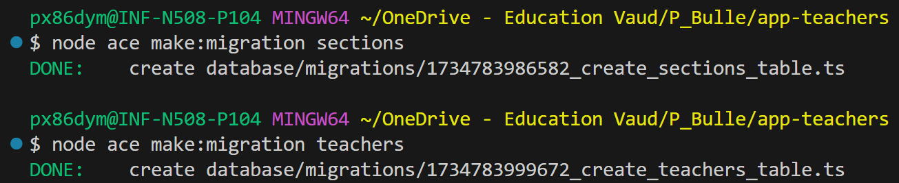
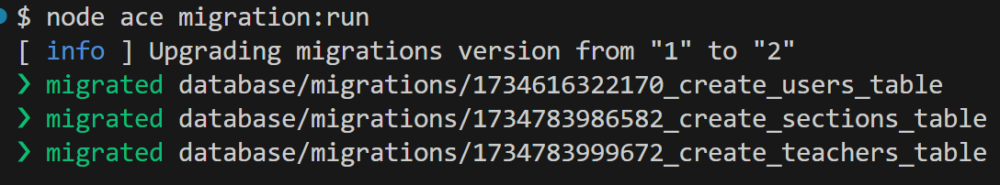
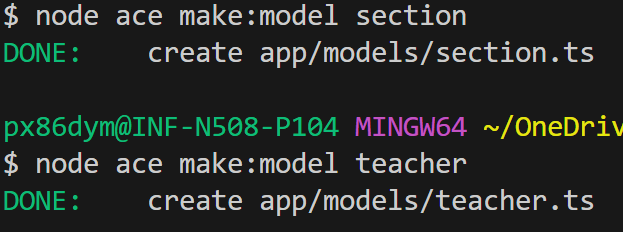
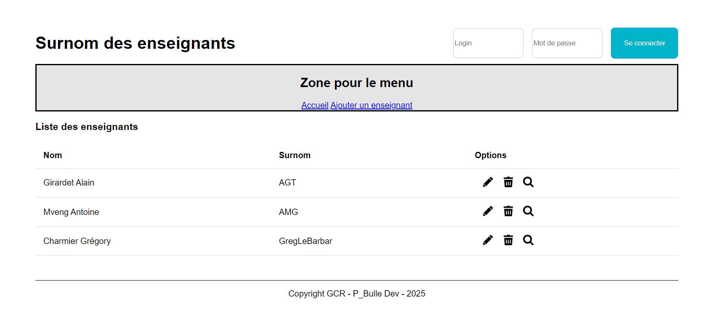

# Application des surnoms des enseignants avec Adonis - Step3

## Création des tables MySQL

Dans cette étape, nous allons apprendre à créer des tables MySQL à l'aide des migrations.

Puis nous allons apprendre à réaliser des modèles (le M du pattern MVC).

## Qu'est ce qu'une migration ?

Une migration est un mécanisme utilisé pour gérer les schémas de base de données dans le cadre d’un projet de développement. Elle permet de créer, modifier ou supprimer des tables et des colonnes dans une base de données de manière versionnée et contrôlée.

Les migrations sont particulièrement utiles dans les frameworks modernes comme AdonisJS, Laravel, Rails, ou Django, où elles offrent une manière structurée et collaborative de gérer l'évolution de la base de données tout au long du cycle de vie d'une application.

## Migrations pour les enseignants et les sections

Nous avons besoin de créer 2 migrations, une pour les enseignants et une autre pour les sections.
Par défaut, AdonisJS nous propose une migration pour les utilisateurs de notre application.

Nous nous préoccupons pas volontairement de cela pour l'instant. Nous y reviendrons lorsque nous mettrons en place le système d'authentification.

### Créer les migrations à l'aide du CLI



Note : L'ordre est important en raison de la clé étrangère section_id

### Compléter les migrations

La migration pour les sections :

```javascript
import { BaseSchema } from '@adonisjs/lucid/schema'

export default class extends BaseSchema {
  protected tableName = 't_section'

  async up() {
    this.schema.createTable(this.tableName, (table) => {
      table.increments('id')
      table.string('name').notNullable()
      table.timestamp('created_at')
      table.timestamp('updated_at')
    })
  }

  async down() {
    this.schema.dropTable(this.tableName)
  }
}
```

La migration pour les enseignants :

```javascript
import { BaseSchema } from '@adonisjs/lucid/schema'

export default class extends BaseSchema {
  protected tableName = 't_teacher'

  async up() {
    this.schema.createTable(this.tableName, (table) => {
      table.increments('id')
      table.string('gender', 1).notNullable().defaultTo('W') // Valeur par défaut W for woman
      table.string('firstname').notNullable()
      table.string('lastname').notNullable()
      table.string('nickname').notNullable()
      table.string('origine').notNullable()
      table
        .integer('section_id') // Clé étrangère
        .unsigned() // La clé ne doit pas être négative
        .references('id') // Référence la colonne `id` de la table `section`
        .inTable('t_section') // Nom de la table de référence
        .onDelete('CASCADE') // Supprime les teachers si la section est supprimée
        .onUpdate('CASCADE') // Met à jour la clé étrangère si l'id change
      table.timestamp('created_at')
      table.timestamp('updated_at')
    })
  }

  async down() {
    this.schema.dropTable(this.tableName)
  }
}
```

### Compléter le fichier .env

Avant de pouvoir exécuter les migrations, nous avons besoin de donner quelques informations sur notre base de données à AdonisJS.

```
TZ=UTC
PORT=3333
HOST=localhost
LOG_LEVEL=info
APP_KEY=vafuca9u0xK5ViwXk-3OCaD4C--nh9O5
NODE_ENV=development
SESSION_DRIVER=cookie
DB_HOST=127.0.0.1
DB_PORT=6033
DB_USER=root
DB_PASSWORD=root
DB_DATABASE=db_teachers
```

Les 4 derniers éléments de configurations doivent être renseignés.

### Lancer les migrations à l'aide du CLI

Il faut commencer par créer la base de données dans MySQL.
Elle a pour nom `db_teachers`.

Ensuite nous pouvons exécuter les migrations :



Vérifier que les 2 tables MySQL correspondantes ont bien été créées.

En réalité, une 3ème table `user` a été créée car une migration par défaut existait.
Nous reviendrons sur cette table, cette migration et ce modèle lorsque nous mettrons en place l'authentification.

## Modèles pour les enseignants et les sections

### Qu'est ce qu'un modèle ?

Un modèle (ou Model) est une représentation logique et structurée des données dans une application. Il sert d'intermédiaire entre la base de données et le reste de l'application, permettant de gérer les interactions avec les données (comme la récupération, la création, la mise à jour et la suppression) tout en offrant une abstraction qui facilite le travail des développeurs.

Les modèles sont au cœur de l'architecture MVC (Model-View-Controller), où ils définissent les règles et la logique métier liées aux données.

### Créer les modèles à l'aide du CLI



### Compléter les modèles

Le code pour le modèle Section :

```javascript
import { DateTime } from 'luxon'
import { BaseModel, column } from '@adonisjs/lucid/orm'

export default class Section extends BaseModel {
  // Renommer le nom de la table pour respecter les conventions de nommage de l'ETML
  public static table = 't_section'

  @column({ isPrimary: true })
  declare id: number

  @column()
  declare name: String

  @column.dateTime({ autoCreate: true })
  declare createdAt: DateTime

  @column.dateTime({ autoCreate: true, autoUpdate: true })
  declare updatedAt: DateTime
}
```

Le code pour le modèle Teacher :

```javascript
import { DateTime } from 'luxon'
import { BaseModel, column, belongsTo } from '@adonisjs/lucid/orm'
import Section from '#models/section'

export default class Teacher extends BaseModel {
  // Renommer le nom de la table pour respecter les conventions de nommage de l'ETML
  public static table = 't_teacher'

  @column({ isPrimary: true })
  declare id: number

  @column()
  declare gender: String

  @column()
  declare firstname: String

  @column()
  declare lastname: String

  @column()
  declare nickname: String

  @column()
  declare origine: String

  @column()
  declare sectionId: number // Colonne correspondant à la clé étrangère

  @belongsTo(() => Section)
  public section: ReturnType<typeof belongsTo> // Relation vers le modèle Section

  @column.dateTime({ autoCreate: true })
  declare createdAt: DateTime

  @column.dateTime({ autoCreate: true, autoUpdate: true })
  declare updatedAt: DateTime
}
```

## Etat de l'application à la fin de cette étape

Voici l'état de l'application en fin d'étape 3.

Nous n'utilisons pas pour l'instant les modèles.



Dans la prochaine étape <a href="https://github.com/GregLeBarbar/app-teachers-adonisjs/tree/step4">step4</a>, nous allons créer notre 1er contrôleur, utiliser le modèle et envoyer des données à la vue.
