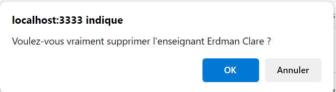

# Application des surnoms des enseignants avec Adonis - Step7

Pour pouvoir supprimer un enseignant, nous allons devoir :

- créer une route
- ajouter une méthode au contrôleur

Par contre, nous n'aurons pas besoin d'une nouvelle vue, car nous allons rediriger l'utilisateur vers la home.

## Route

Dans le fichier `routes.ts`:

```js
// Route permettant de supprimer un enseignant
router.get('/teacher/:id/destroy', [TeachersController, 'destroy']).as('teacher.destroy')
```

A noter le nom de la route `teacher.destroy`.

## Contrôleur

Dans le contrôleur `teachers_controller.ts` :

```js
  /**
   * Supprimer un enseignant
   */
  async destroy({ params, session, response }: HttpContext) {
    // Sélectionne l'enseignant à supprimer
    const teacher = await Teacher.findOrFail(params.id)

    // Supprime l'enseignant
    await teacher.delete()

    // Afficher un message à l'utilisateur
    session.flash('success', "L'enseignant a été supprimé avec succès !")

    // Redirige l'utilisateur sur la home
    return response.redirect().toRoute('home')
  }
```

Il est important de noter que nous allons utiliser un système de message Flash directement disponible dans AdonisJS.

Nous devons créer un peu de code de template pour afficher le message dans les vues :

Voici le fichier `views/patials/flash.edge`

```edge
@if(flashMessages.has('success'))
  <div class="alert alert-success">
    {{ old('success') }}
  </div>
@end

@if(flashMessages.has('error'))
  <div class="alert alert-danger">
    {{ old('error') }}
  </div>
@end
```

Et il faut l'inclure dans le `layout.edge`

```edge
<!DOCTYPE html>
<html lang="fr">
  <head>
    <meta charset="UTF-8" />
    <meta http-equiv="X-UA-Compatible" content="IE=edge" />
    <meta name="viewport" content="width=device-width, initial-scale=1" />
    @vite(['resources/css/app.css', 'resources/js/app.js'])
    <title>
      {{ title || "Application des surnoms des enseignants" }}
    </title>
  </head>
  <body>
    @include('partials/header')
    @include('partials/flash')
    <div class="container">
      {{{ await $slots.main() }}}
    </div>
    @include('partials/footer')
  </body>
</html>
```

Pour que l'affichage soit en rouge en cas d'erreur ou en vert en cas de succès, nous devons ajouter un peu de code CSS.

Comme ce projet consiste à apprendre le framework AdonisJS et pas le CSS, on en profite pour mettre ici tout le CSS nécessaire aux futures étapes.

```css
body {
  font-family: 'Helvetica Neue', Helvetica, Arial, sans-serif;
  margin: auto;
  width: 80%;
}

nav {
  border: black solid 3px;
  background-color: hsl(0, 0%, 90%);
  height: 50px;
  display: flex;
  align-items: center;
  justify-content: center;
}

.container {
  height: 50%;
}

footer {
  border-top: black solid 1px;
  text-align: center;
  margin-top: 3vw;
}

table {
  width: 100%;
  border-collapse: collapse;
  text-align: left;
}

th,
td {
  padding: 1vw;
  border-bottom: #ddd solid 1px;
}

.containerOptions a,
.user-head a {
  text-decoration: none;
  height: 100%;
  margin-left: 1vw;
}

.user-head {
  width: 100%;
  display: flex;
  flex-direction: row;
  justify-content: space-between;
  align-items: center;
}

.user-footer {
  text-align: right;
}

.left,
.rigth {
  display: inline-block;
}

.left {
  width: 70%;
}

label {
  display: inline-block;
  width: 10%;
}

.container-header {
  display: flex;
  justify-content: center;
  align-items: center;
  padding-top: 5%;
}

.titre-header {
  width: 60%;
  height: 100%;
}

.login-container {
  width: 40%;
  height: 100%;
  display: flex;
  justify-content: end;
  align-items: center;
}

.login-container form {
  display: flex;
  justify-content: space-between;
}

.login-container label {
  display: none;
}

.login-container input,
.login-container .btn-login {
  width: 30%;
  display: inline-block;
  border: 1px solid #ccc;
  border-radius: 8px;
}

.login-container h3 {
  display: inline-block;
  width: 30%;
  text-align: right;
  margin-right: 1vw;
}

.login-container input {
  height: 4em;
  margin-bottom: auto;
  margin-top: auto;
}

.btn-login {
  background-color: #00b4cc;
}

.btn {
  text-align: center;
  color: white;
  width: 100%;
  border: none;
  cursor: pointer;
  height: 4.5em;
  border-radius: 8px;
}

.btn:hover {
  opacity: 0.8;
}

.btn-logout {
  background-color: coral;
  padding: 20px;
  margin: 10px;
}

.text-danger {
  color: red;
}

.alert {
  padding: 15px;
  border-radius: 4px;
  font-size: 16px;
  margin: 10px 0;
}

.alert-success {
  background-color: #d4edda;
  border: 1px solid #c3e6cb;
  color: #155724;
}

.alert-danger {
  background-color: #f8d7da;
  border: 1px solid #f5c6cb;
  color: #721c24;
  padding: 15px;
  border-radius: 4px;
  font-size: 16px;
  margin: 10px 0;
}

.field {
  margin-top: 10px;
  margin-bottom: 10px;
}

.radio {
  margin-top: 5px;
  margin-bottom: 15px;
}
```

## Modifier la homepage et la page des détails

Dans la homepage, nous devons mettre à jour le lien pour afficher supprimer un enseignant.

```edge
<a
  onClick="return confirm(`Voulez-vous vraiment supprimer l'enseignant {{ teacher.lastname }} {{ teacher.firstname }} ?`)"
  href="{{ route('teacher.destroy', {id: teacher.id}) }}"
>
```

> Exercice :<br>
> Vous devez faire la même chose pour le lien `supprimer` présent dans la page `détail d'un enseignant`.

## Etat de l'application à la fin de cette étape



Dans la prochaine étape <a href="https://github.com/GregLeBarbar/app-teachers-adonisjs/tree/step8">step8</a>, nous allons gérer l'ajout d'un nouvel enseignant.
