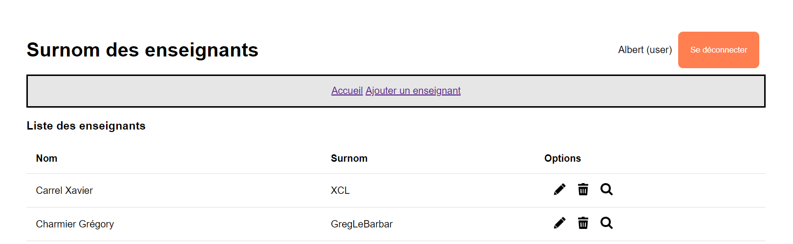

# Application des surnoms des enseignants avec Adonis - Step12

Nous allons mettre en place le logout.

pour cela, nous avons besoin :

- d'une nouvelle route
- d'une nouvelle méthode dans `AuthController`

## Routes

```js
// Route permettant de se déconnecter
router.post('/logout', [AuthController, 'handleLogout']).as('auth.handleLogout')
```

## Contrôleur AuthController

```js
  /**
   * Gérer la déconnexion d'un utilisateur
   */
  async handleLogout({ auth, session, response }: HttpContext) {
    // Utilise le Guard 'web' pour déconnecter l'utilisateur -> Voir le fichier config/auth.ts
    await auth.use('web').logout()

    // Affiche un message à l'utilisateur
    session.flash('success', "L'utilisateur s'est déconnecté avec succès")

    // Redirige la réponse sur la route 'home'
    return response.redirect().toRoute('home')
  }
```

## Bouton 'Se connecter' et 'Se déconnecter'

Dans le fichier `header.edge` nous allons ajouter un bouton "Se déconnecter" ainsi que l'affichage du username de l'utilisateur connecté.

```
    ...
    @if(auth.isAuthenticated)
      {{ auth.user.username }} ({{ auth.user.isAdmin  ? 'admin' : 'user' }})
      <form action="{{ route('auth.handleLogout') }}" method="post">
        {{ csrfField() }}
      <button type="submit" class="btn btn-logout">Se déconnecter</button>
      </form>
    @else
    ...
```

## Etat de l'application à la fin de cette étape



Dans la prochaine étape <a href="https://github.com/GregLeBarbar/app-teachers-adonisjs/tree/step13">step13</a>, nous allons poursuivre avec la gestion des rôles et la protection des pages.
