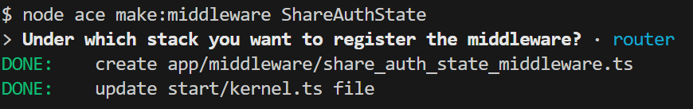
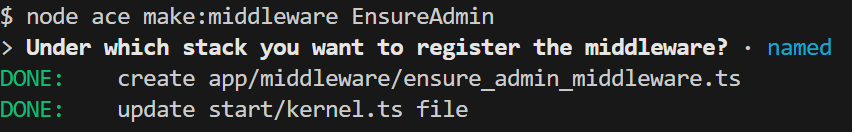

# Application des surnoms des enseignants avec Adonis - Step13

## Gestion des rôles

Dans cette étape nous allons mettre en place la gestion des rôles.

### Utilisateur non authentifié

Un utilisateur non authentifié peut uniquement voir la liste des enseignants de la homepage.
Aucune action est possible pour lui.

### Utilisateur authentifié non admin

Un utilisateur authentifié mais non admin peut uniquement :

- voir la liste des enseignants de la homepage
- voir les détails d'un enseignant

### Utilisateur authentifié mais admin

Un utilisateur authentifié et admin peut tout faire sur l'application.

## Utilisation des middlewares

Par défaut, nous avons plusieurs middlewares à disposition :

- auth() : il faut que l'utilisateur soit authentifié pour accéder à la route en question
- guest() : il faut que l'utilisateur ne soit pas authentifié pour accéder à la route en question

Voilà le fichier des routes mis à jour :

```js
/*
|--------------------------------------------------------------------------
| Le fichier des routes
|--------------------------------------------------------------------------
|
| Le fichier des routes a pour but de définir toutes les routes HTTP.
|
*/

import AuthController from '#controllers/auth_controller'
import TeachersController from '#controllers/teachers_controller'
import router from '@adonisjs/core/services/router'
import { middleware } from './kernel.js'

router.get('/', [TeachersController, 'index']).as('home')

// Route permettant de voir les détails d'un enseignant
router
  .get('/teacher/:id/show', [TeachersController, 'show'])
  .as('teacher.show')
  .use(middleware.auth())

// Route permettant d'afficher le formulaire permettant l'ajout d'un enseignant
router
  .get('/teacher/add', [TeachersController, 'create'])
  .as('teacher.create')
  .use(middleware.auth())

// Route permettant l'ajout de l'enseignant
router
  .post('/teacher/add', [TeachersController, 'store'])
  .as('teacher.store')
  .use(middleware.auth())

// Route permettant d'afficher le formulaire permettant la mise à jour d'un enseignant
router
  .get('/teacher/:id/edit', [TeachersController, 'edit'])
  .as('teacher.edit')
  .use(middleware.auth())

// Route permettant la modification de l'enseignant
router
  .post('/teacher/:id/update', [TeachersController, 'update'])
  .as('teacher.update')
  .use(middleware.auth())

// Route permettant de supprimer un enseignant
router
  .get('/teacher/:id/destroy', [TeachersController, 'destroy'])
  .as('teacher.destroy')
  .use(middleware.auth())

// Route permettant de se connecter
router
  .post('/login', [AuthController, 'handleLogin'])
  .as('auth.handleLogin')
  .use(middleware.guest())

// Route permettant de se déconnecter
router
  .post('/logout', [AuthController, 'handleLogout'])
  .as('auth.handleLogout')
  .use(middleware.auth())
```

Sans être authentifié, si nous essayons d'accéder à l'URL `http://localhost:3333/teacher/add` nous obtenons l'erreur :

```
Cannot GET:/login
```

Pourquoi ?

Car dans le fichier `auth_middleware.ts`, la variable `redirectTo` est définie avec la valeur `'/login'`.

Il faut simplement changer en `'/'`.

Voici le code complet de ce fichier :

```js
import type { HttpContext } from '@adonisjs/core/http'
import type { NextFn } from '@adonisjs/core/types/http'
import type { Authenticators } from '@adonisjs/auth/types'

/**
 * Auth middleware is used authenticate HTTP requests and deny
 * access to unauthenticated users.
 */
export default class AuthMiddleware {
  /**
   * The URL to redirect to, when authentication fails
   */
  redirectTo = '/'

  async handle(
    ctx: HttpContext,
    next: NextFn,
    options: {
      guards?: (keyof Authenticators)[]
    } = {}
  ) {
    await ctx.auth.authenticateUsing(options.guards, { loginRoute: this.redirectTo })
    return next()
  }
}
```

## Création d'un middleware pour partager l'état de l'authentification

Création du middleware via le CLI :



### Résumé des Options

| **Option** | **Quand l’utiliser**                                                                     |
| ---------- | ---------------------------------------------------------------------------------------- |
| **Server** | Pour des middlewares globaux applicables à toutes les requêtes.                          |
| **Router** | Pour des middlewares applicables uniquement aux requêtes qui correspondent à des routes. |
| **Named**  | Pour des middlewares spécifiques appliqués manuellement à certaines routes ou groupes.   |

```js
import type { HttpContext } from '@adonisjs/core/http'
import type { NextFn } from '@adonisjs/core/types/http'

export default class ShareAuthStateMiddleware {
  public async handle(ctx: HttpContext, next: NextFn) {
    /**
     * Middleware logic goes here (before the next call)
     */
    const { auth, view } = ctx // Extraction de auth et view depuis le contexte

    try {
      // Vérifie si l'utilisateur est authentifié
      const isAuthenticated = await auth.check()

      // Partage la variable dans les vues
      view.share({ isAuthenticated })
    } catch (error) {
      // Gestion d'erreurs éventuelles
      console.log(error)
      view.share({ isAuthenticated: false })
    }

    // Passe au middleware suivant ou à la logique de la route
    await next()
  }
}
```

Un autre facteur est très important lorsque l'on créé son propre middleware c'est l'ordre des middleware.

Dans notre middleware nous utilisons `auth` donc nous devons définir notre middleware après le middleware qui initialise `auth`.

Dans le fichier `start/kernel.ts` :

```js
/*
|--------------------------------------------------------------------------
| HTTP kernel file
|--------------------------------------------------------------------------
|
| The HTTP kernel file is used to register the middleware with the server
| or the router.
|
*/

import router from '@adonisjs/core/services/router'
import server from '@adonisjs/core/services/server'

/**
 * The error handler is used to convert an exception
 * to a HTTP response.
 */
server.errorHandler(() => import('#exceptions/handler'))

/**
 * The server middleware stack runs middleware on all the HTTP
 * requests, even if there is no route registered for
 * the request URL.
 */
server.use([
  () => import('#middleware/container_bindings_middleware'),
  () => import('@adonisjs/static/static_middleware'),
  () => import('@adonisjs/vite/vite_middleware'),
])

/**
 * The router middleware stack runs middleware on all the HTTP
 * requests with a registered route.
 */
router.use([
  () => import('@adonisjs/core/bodyparser_middleware'),
  () => import('@adonisjs/session/session_middleware'),
  () => import('@adonisjs/shield/shield_middleware'),
  () => import('@adonisjs/auth/initialize_auth_middleware'),
  () => import('#middleware/share_auth_state_middleware'),
])

/**
 * Named middleware collection must be explicitly assigned to
 * the routes or the routes group.
 */
export const middleware = router.named({
  guest: () => import('#middleware/guest_middleware'),
  auth: () => import('#middleware/auth_middleware'),
})
```

Maintenant dans le fichier `resources/views/pages/home.edge` on peut utiliser la variable `isAuthenticated` partagé dans le middleware pour voir si l'utilisateur est authentifié :

```edge
...
<td class="containerOptions">
  @if(isAuthenticated)
    <a href="{{ route('teacher.edit', {id: teacher.id}) }}">
      
    </a>
    <a
      onClick="return confirm(`Voulez-vous vraiment supprimer l'enseignant {{ teacher.lastname }} {{ teacher.firstname }} ?`)"
      href="{{ route('teacher.destroy', {id: teacher.id}) }}"
    >
      
    </a>
    <a href="{{ route('teacher.show', {id: teacher.id}) }}">
      
    </a>
  @endif
</td>
...
```

La même chose dans le `resources/views/partials/header.edge` :

```js
<header>
  <div class="container-header">
    <div class="titre-header">
      <h1>
        Surnom des enseignants
      </h1>
    </div>
    <div class="login-container">
      @if(isAuthenticated)
        {{ auth.user.username }} ({{ auth.user.isAdmin  ? 'admin' : 'user' }})
        <form action="{{ route('auth.handleLogout') }}" method="post">
          {{ csrfField() }}
        <button type="submit" class="btn btn-logout">Se déconnecter</button>
        </form>
      @else
        <form action="{{ route('auth.handleLogin') }}" method="post">
          {{ csrfField() }}
          @!component('components/input', { name: 'username', label: "Nom d'utilisateur"})
          @!component('components/input', { name: 'password', label: 'Mot de passe', type: 'password'})
          <button type="submit" class="btn btn-login">Se connecter</button>
        </form>
      @endif
    </div>
  </div>
  <nav>
    <a href="{{ route('home') }}">Accueil</a>&nbsp;
    @if(isAuthenticated)
      <a href="{{ route('teacher.create') }}">Ajouter un enseignant</a>
    @endif
  </nav>
</header>
```

## Vérification du rôle admin pour les méthodes du contrôleur TeachersController

Pour mettre en place la gestion des rôles, nous devons vérifier que l'utilisateur a le droit admin pour les méthodes suivantes :

- create
- store
- edit
- update
- destroy

Pour cela nous allons créer un nouveau middleware.



Code du fichier `ensure_admin_middleware.ts`

```js
import type { HttpContext } from '@adonisjs/core/http'
import type { NextFn } from '@adonisjs/core/types/http'

export default class EnsureAdminMiddleware {
  async handle(ctx: HttpContext, next: NextFn) {
    const { auth, session, response } = ctx

    try {
      // Vérifie si l'utilisateur est connecté
      const isAuthenticated = await auth.check()
      if (!isAuthenticated || !auth.user?.isAdmin) {
        // Affiche un message d'erreur à l'utilisateur
        session.flash('error', 'Vous devez avoir les droits admin pour accéder à cette page')

        // Redirige l'utilisateur vers la page d'accueil
        return response.redirect().toRoute('home')
      }

      // Passe au middleware suivant ou à la logique de la route
      await next()
    } catch (error) {
      console.error('Erreur dans EnsureAdminMiddleware :', error)

      // Redirige vers la page d'accueil en cas d'erreur
      session.flash('error', 'Une erreur est survenue')
      return response.redirect().toRoute('home')
    }
  }
}
```

On utilise ce nouveau `middleware` pour protéger nos routes.

```js
/*
|--------------------------------------------------------------------------
| Le fichier des routes
|--------------------------------------------------------------------------
|
| Le fichier des routes a pour but de définir toutes les routes HTTP.
|
*/

import AuthController from '#controllers/auth_controller'
import TeachersController from '#controllers/teachers_controller'
import router from '@adonisjs/core/services/router'
import { middleware } from './kernel.js'

// Route permettant d'accéder à la liste des enseignants (homepage)
router.get('/', [TeachersController, 'index']).as('home')

// Route permettant de voir les détails d'un enseignant
router
  .get('/teacher/:id/show', [TeachersController, 'show'])
  .as('teacher.show')
  .use(middleware.auth())

// Route permettant d'afficher le formulaire permettant l'ajout d'un enseignant
router
  .get('/teacher/add', [TeachersController, 'create'])
  .as('teacher.create')
  .use(middleware.auth())
  .use(middleware.ensureAdmin())

// Route permettant l'ajout de l'enseignant
router
  .post('/teacher/add', [TeachersController, 'store'])
  .as('teacher.store')
  .use(middleware.auth())
  .use(middleware.ensureAdmin())

// Route permettant d'afficher le formulaire permettant la mise à jour d'un enseignant
router
  .get('/teacher/:id/edit', [TeachersController, 'edit'])
  .as('teacher.edit')
  .use(middleware.auth())
  .use(middleware.ensureAdmin())

// Route permettant la modification de l'enseignant
router
  .post('/teacher/:id/update', [TeachersController, 'update'])
  .as('teacher.update')
  .use(middleware.auth())
  .use(middleware.ensureAdmin())

// Route permettant de supprimer un enseignant
router
  .get('/teacher/:id/destroy', [TeachersController, 'destroy'])
  .as('teacher.destroy')
  .use(middleware.auth())
  .use(middleware.ensureAdmin())

// Route permettant de se connecter
router
  .post('/login', [AuthController, 'handleLogin'])
  .as('auth.handleLogin')
  .use(middleware.guest())

// Route permettant de se déconnecter
router
  .post('/logout', [AuthController, 'handleLogout'])
  .as('auth.handleLogout')
  .use(middleware.auth())
```

La dernière chose qu'il nous reste à faire, est de nous assurer que seul un admin peut accéder aux actions `edit` et `destroy` depuis la vue `show`.

Dans le fichier `views/pages/teachers/show.edge` est :

```js
@if(auth.user.isAdmin)
  <div class="actions">
    <a href="{{ route('teacher.edit', {id: teacher.id}) }}">
      
    </a>
    <a
      onClick="return confirm(`Voulez-vous vraiment supprimer l'enseignant {{ teacher.lastname }} {{ teacher.firstname }} ?`)"
      href="{{ route('teacher.destroy', {id: teacher.id}) }}"
    >
      
    </a>
  </div>
@endif
```
