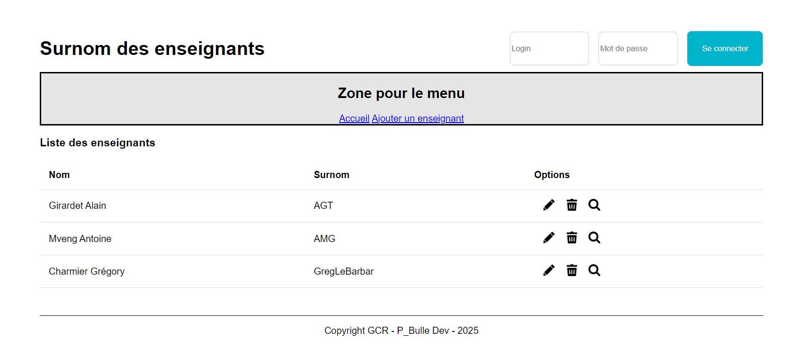

# Application des surnoms des enseignants avec Adonis - Step2

## Gestionnaire de templates EDGE

Dans cette étape, nous allons apprendre à utiliser le gestionnaire de templates d'adonisJS.

Nous allons donc essentiellement travailler dans les vues (le V du pattern MVC)

## Qu'est ce qu'un gestionnaire de template ?

Un gestionnaire de templates (ou moteur de templates) est un outil ou une bibliothèque qui permet de générer du contenu HTML dynamique en combinant des fichiers de templates statiques avec des données dynamiques fournies par une application.

Ces gestionnaires simplifient le processus de création et de gestion des vues dans une application en séparant clairement la logique de présentation (HTML/CSS) de la logique métier.

## Définir un layout

Un layout (ou mise en page en français) est une structure commune utilisée dans les applications web pour définir une organisation ou un modèle de base partagé par plusieurs pages. Il sert à encapsuler les éléments répétés, comme les en-têtes, pieds de page, barres de navigation, et autres composants communs.

L'utilisation des layouts permet de réduire la duplication de code et d'assurer une cohérence visuelle et structurelle sur l'ensemble des pages de l'application.

Avec AdonisJS 6 les layout ont été abandonnés. <a href="https://github.com/orgs/adonisjs/discussions/4358">Voir discussion ici</a>

Cela ne veut pas dire que nous ne pouvons plus en faire.
Cela signifie simplement que pour en faire, nous allons créer un composant.

## Composant Layout

Nous allons donc centralisé la structure de notre page dans un fichier `layout.edge` présent dans `views/components/`.

```javascript
<!DOCTYPE html>
<html lang="fr">
  <head>
    <meta charset="UTF-8" />
    <meta http-equiv="X-UA-Compatible" content="IE=edge" />
    <meta name="viewport" content="width=device-width, initial-scale=1" />
    @vite(['resources/css/app.css', 'resources/js/app.js'])
    <title>
      {{ title || "Application des surnoms des enseignants" }}
    </title>
  </head>
  <body>
    @include('partials/header')
    <div class="container">
      {{{ await $slots.main() }}}
    </div>
    @include('partials/footer')
  </body>
</html>
```

Grâce à la ligne `{{{ await $slots.main() }}}` nous pourrons définir le contenu de chaque page.

`Important` : Noter la présence des triples accolades

## Partials Header et Footer

Un partial (ou fragment de vue) est un morceau de code HTML ou de template qui représente une petite partie d'une page. Contrairement à un layout qui structure la page entière, un partial est utilisé pour encapsuler des composants réutilisables ou des sections spécifiques d'une page.

Les partials sont utiles pour :

- Réutiliser des éléments comme des menus, des formulaires, ou des tableaux.
- Simplifier la structure des templates en décomposant les pages en composants plus petits et plus faciles à gérer.

Dans notre cas, nous allons créer un partial pour le footer et un autre pour le header.

Le header :

```javascript
<header>
  <div class="container-header">
    <div class="titre-header">
      <h1>Surnom des enseignants</h1>
    </div>
    <div class="login-container">
      <form action="#" method="post">
        <label for="user"></label>
        <input type="text" name="user" id="user" placeholder="Login" />
        <label for="password"></label>
        <input type="password" name="password" id="password" placeholder="Mot de passe" />
        <button type="submit" class="btn btn-login">
          Se connecter
        </button>
      </form>
    </div>
  </div>
  <nav>
    <h2>Zone pour le menu</h2>
    <a href="index.html">Accueil</a>
    <a href="addTeacher.html">Ajouter un enseignant</a>
  </nav>
</header>
```

Le footer :

```javascript
<footer>
  <p>Copyright GCR - P_Bulle Dev - 2025</p>
</footer>
```

## Utilisation du layout dans la vue home

```javascript
@component('components/layout', { title: 'Accueil' })
  <h3>
    Liste des enseignants
  </h3>
  <form action="#" method="post">
    <table>
      <thead>
        <tr>
          <th>
            Nom
          </th>
          <th>
            Surnom
          </th>
          <th>
            Options
          </th>
        </tr>
      </thead>
      <tbody>
        <tr>
          <td>
            Girardet Alain
          </td>
          <td>
            AGT
          </td>
          <td class="containerOptions">
            <a href="#">
              
            </a>
            <a href="javascript:confirmDelete()">
              
            </a>
            <a href="detailTeacher.html">
              
            </a>
          </td>
        </tr>
        <tr>
          <td>
            Mveng Antoine
          </td>
          <td>
            AMG
          </td>
          <td class="containerOptions">
            <a href="#">
              
            </a>
            <a href="javascript:confirmDelete()">
              
            </a>
            <a href="#">
              
            </a>
          </td>
        </tr>
        <tr>
          <td>
            Charmier Grégory
          </td>
          <td>
            GregLeBarbar
          </td>
          <td class="containerOptions">
            <a href="#">
              
            </a>
            <a href="javascript:confirmDelete()">
              
            </a>
            <a href="#">
              
            </a>
          </td>
        </tr>
      </tbody>
    </table>
  </form>
@endcomponent
```

Voila ! `Notre layout` est en place.

## Etat de l'application à la fin de cette étape



Dans la prochaine étape <a href="https://github.com/GregLeBarbar/app-teachers-adonisjs/tree/step3">step3</a>, nous allons nous intéresser à la base de données et comment créer les tables MySQL dont nous avons besoin pour notre application.
