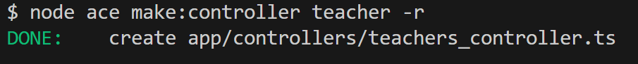
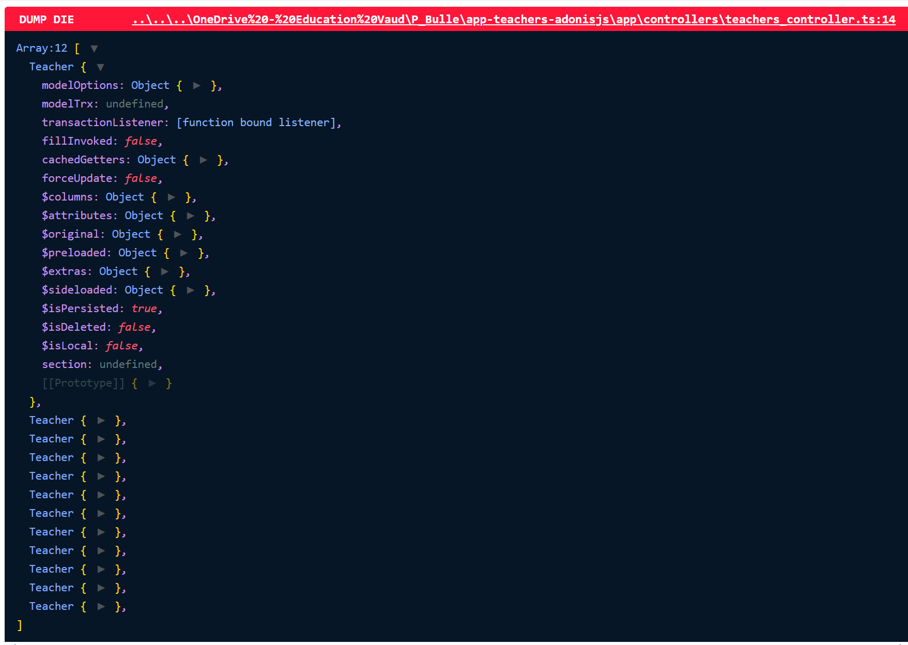
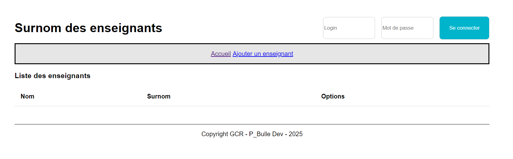
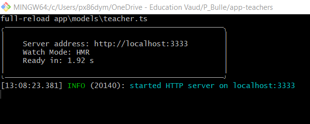

# Application des surnoms des enseignants avec Adonis - Step4

## Création du contrôleur pour les enseignants

Dans cette étape, nous allons apprendre à créer contrôleur.

## Qu'est ce qu'un contrôleur ?

Un contrôleur est un composant clé dans le cadre d’une architecture MVC (Model-View-Controller).

Il agit comme un intermédiaire entre la logique métier (modèles) et l'interface utilisateur (vues).
Son rôle principal est de traiter les requêtes entrantes, d’interagir avec les modèles pour récupérer ou manipuler des données, puis de retourner une réponse appropriée (souvent sous forme de vue ou de données JSON).

## Créer le controleur teacher à l'aide du CLI



A noter l'option `-r` pour ressource qui permet d'avoir l'ensemble des signatures des méthodes présentes dans le contrôleur.

## Définir la méthode index

```javascript
import Teacher from '#models/teacher'
import type { HttpContext } from '@adonisjs/core/http'

export default class TeachersController {
  /**
   * Afficher la liste des enseignants
   */
  async index({ view }: HttpContext) {
    //
    // Récupérer la liste des enseignants triés par ordre alphabétique sur le nom et le prénom
    const teachers = await Teacher.query().orderBy('lastname', 'asc').orderBy('firstname', 'asc')

    // Appel de la vue
    return view.render('pages/home', { teachers })
  }

  /**
   * Display form to create a new record
   */
  async create({}: HttpContext) {}

  /**
   * Handle form submission for the create action
   */
  async store({ request }: HttpContext) {}

  /**
   * Show individual record
   */
  async show({ params }: HttpContext) {}

  /**
   * Edit individual record
   */
  async edit({ params }: HttpContext) {}

  /**
   * Handle form submission for the edit action
   */
  async update({ params, request }: HttpContext) {}

  /**
   * Delete record
   */
  async destroy({ params }: HttpContext) {}
}
```

## Qu'est ce qu'une route ?

Une route, dans un framework comme AdonisJS, est une définition qui associe une URL à une logique métier (une fonction ou un contrôleur).
Les routes permettent de gérer les requêtes des utilisateurs et de retourner les réponses correspondantes.

## Amélioration de la route homepage

```javascript
/*
|--------------------------------------------------------------------------
| Le fichier des routes
|--------------------------------------------------------------------------
|
| Le fichier des routes a pour but de définir toutes les routes HTTP.
|
*/

import TeachersController from '#controllers/teachers_controller'
import router from '@adonisjs/core/services/router'

router.get('/', [TeachersController, 'index']).as('home')
```

A noter que nous avons donner un nom à la route.
Ceci nous permet d'utiliser ce nom partout dans l'application.

Ainsi, nous pouvons décider de modifier l'URL d'une route sans que cela nécessite des changements dans notre (à part le fichier `routes.ts`).

## Amélioration de la vue home

Fichier `views/partials/header.edge`

```edge
<nav>
  <a href="{{ route('home') }}">Accueil</a>&nbsp;
    <a href="addTeacher.html">Ajouter un enseignant</a>
</nav>
```

Fichier `css/app.css`

```css
nav {
  border: black solid 3px;
  background-color: hsl(0, 0%, 90%);
  height: 50px;
  display: flex;
  align-items: center;
  justify-content: center;
}
```

Fichier `views/pages/home.edge`

```javascript
@component('components/layout', { title: 'Accueil' })

  <h3>
    Liste des enseignants
  </h3>
  <form action="#" method="post">
    <table>
      <thead>
        <tr>
          <th>
            Nom
          </th>
          <th>
            Surnom
          </th>
          <th>
            Options
          </th>
        </tr>
      </thead>
      <tbody>
        @each ((teacher, index) in teachers)
          <tr>
            <td>
              {{ teacher.lastname }} {{ teacher.firstname }}
            </td>
            <td>
              {{ teacher.nickname }}
            </td>
            <td class="containerOptions">
              <a href="#">
                
              </a>
              <a href="javascript:confirmDelete()">
                
              </a>
              <a href="detailTeacher.html">
                
              </a>
            </td>
          </tr>
        @end
      </tbody>
    </table>
  </form>
@endcomponent
```

## Debugger facilement grâce dd()

La méthode dd() (abréviation de dump and die) est une fonction de débogage intégrée dans AdonisJS.

Elle permet d'afficher des informations utiles sur des variables, des objets ou d'autres données, puis d'arrêter immédiatement l'exécution du script.

Exemple :

```js
import { dd } from '@adonisjs/core/services/dumper'
...
async index({ view }: HttpContext) {
    //
    // Récupérer la liste des enseignants triés par ordre alphabétique sur le nom et le prénom
    const teachers = await Teacher.query().orderBy('lastname', 'asc').orderBy('firstname', 'asc')

    dd(teachers)

    // Appel de la vue
    return view.render('pages/home', { teachers })
  }
```



## Etat de l'application à la fin de cette étape

Notre application a toujours qu'une page à savoir la homepage.



Nous n'avons pour l'instant aucune donnée dans notre base de données.

C'est normal qu'aucun enseignant ne soit affiché !

Pour s'assurer que tout est normal, on peut vérifier dans la console qu'aucune erreur est indiqué.



Dans la prochaine étape <a href="https://github.com/GregLeBarbar/app-teachers-adonisjs/tree/step5">step5</a>, nous allons ajouter des données à notre application.
