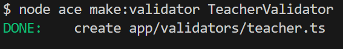
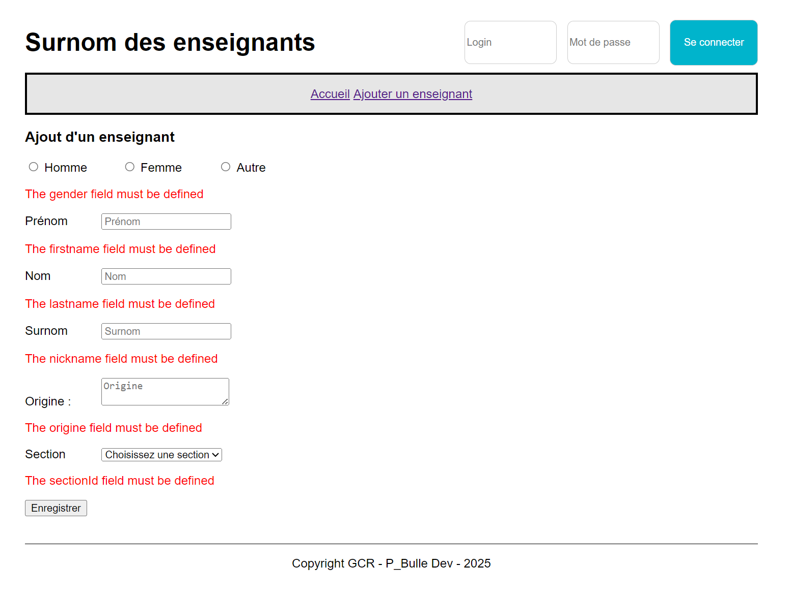

# Application des surnoms des enseignants avec Adonis - Step8

Pour pouvoir ajouter un enseignant, nous allons devoir :

- créer deux routes :
  - une route pour afficher le formulaire permettant de renseigner les informations de l'enseignant
  - une route pour gérer l'ajout de l'enseignant
- ajouter un validateur
- ajouter deux méthodes au contrôleur
- ajouter une vue

## Routes

Dans le fichier `routes.ts`:

```js
// Route permettant d'afficher le formulaire permettant l'ajout d'un enseignant
router.get('/teacher/add', [TeachersController, 'create']).as('teacher.create')

// Route permettant l'ajout de l'enseignant
router.post('/teacher/add', [TeachersController, 'store']).as('teacher.store')
```

## Validateur

Le validateur va nous permettre de valider les données saisies par l'utilisateur.

Comme d'habitude, nous allons utiliser le CLI pour créer le validateur.



Voici maintenant le contenu du fichier `validators/teacher.ts` :

```js
import vine from '@vinejs/vine'

const teacherValidator = vine.compile(
  vine.object({
    gender: vine.string().minLength(1).maxLength(1),
    firstname: vine.string().minLength(2),
    lastname: vine.string().minLength(2),
    nickname: vine.string().minLength(2),
    origine: vine.string().minLength(2),
    sectionId: vine.number(),
  })
)

export { teacherValidator }
```

## Contrôleur

Dans le contrôleur `teachers_controller.ts` :

```js
  /**
   * Afficher le formulaire pour créer un nouvel enseignant
   */
  async create({ view }: HttpContext) {
    // Récupération des sections triées par le nom
    const sections = await Section.query().orderBy('name', 'asc')

    // Appel de la vue
    return view.render('pages/teachers/create', { title: "Ajout d'un enseignant", sections })
  }

  /**
   * Gérer la soumission du formulaire pour la création d'un enseignant
   */
  async store({ request, session, response }: HttpContext) {
    // Validation des données saisies par l'utilisateur
    const { gender, firstname, lastname, nickname, origine, sectionId } =
      await request.validateUsing(teacherValidator)

    // Création du nouvel enseignant
    await Teacher.create({ gender, firstname, lastname, nickname, origine, sectionId })

    // Afficher un message à l'utilisateur
    session.flash('success', 'Le nouvel enseignant a été ajouté avec succès !')

    // Rediriger vers la homepage
    return response.redirect().toRoute('home')
  }
```

## Ajout de la vue create.edge

Cette vue a pour but d'afficher le formulaire permettant de renseigner les informations de l'enseignant.

Si certaines règles ne sont pas respectés (champs obligatoires, nombre de caractères, etc) on doit afficher des erreurs à l'utilisateur directement dans le formulaire.

Pour simplifier la gestion des formulaires, nous allons créer différents composants .

Nous aurons un composant :

- input
- select
- radio
- textarea

Ces composants seront utilisés dans la vue `create.edge` de cette manière :

```edge
@component('components/layout', { title: title })
  <h3>
    {{ title }}
  </h3>
  <form action="{{ route('teacher.store') }}" method="post">
    {{ csrfField() }}
    <div class="radio">
      @!component('components/radio', {
      name: 'gender',
      value: old('gender'))      ,
      options: [
        { value: 'M', label: 'Homme' },
        { value: 'W', label: 'Femme' },
        { value: 'O', label: 'Autre' }
      ]
      })
    </div>

    <div class="field">
      @!component('components/input', { name: 'firstname', label: 'Prénom', value: old('firstname') })
    </div>

    <div class="field">
      @!component('components/input', { name: 'lastname', label: 'Nom', value: old('lastname') })
    </div>

    <div class="field">
      @!component('components/input', { name: 'nickname', label: 'Surnom', value: old('nickname') })
    </div>

    <div class="field">
      @!component('components/textarea', { name: 'origine', label: 'Origine', value: old('origine') })
    </div>

    <div class="field">
      @!component('components/select', {
      name: 'sectionId',
      label: 'Section',
      sections: sections,
      value: old('section'),
      placeholder: 'Choisissez une section'
      })
    </div>

    <button type="submit">Enregistrer</button>
  </form>
@endcomponent
```

Le composant radio :

```edge
@each((option, index) in options)
  <input
    type="radio"
    id="{{ name }}{{ index }}"
    name="{{ name }}"
    value="{{ option.value }}"
    {{ option.value === (value || old(name)) ? 'checked' : '' }}
  />
  <label for="{{ name }}{{ index }}">{{ option.label }}</label>
@end

@if(flashMessages.get('errors.' + name))
  <p class="text-danger">
    {{ flashMessages.get('errors.' + name)[0] }}
  </p>
@endif
```

Le composant input :

```edge
<label for="{{ name }}">{{ label }}</label>
<input
  type="{{ type || text }}"
  name="{{ name }}"
  id="{{ name }}"
  value="{{ value || '' }}"
  placeholder="{{ label }}"
/>
@inputError(name)
  @each(message in $messages)
    <p class="text-danger">
      {{ message }}
    </p>
  @end
@end
```

Le composant textarea :

```edge
<label for="{{ name }}">{{ label }} :</label>
<textarea name="{{ name }}" id="{{ name }}" placeholder="{{ label }}">{{ value }}</textarea>
@inputError(name)
  @each(message in $messages)
    <p class="text-danger">
      {{ message }}
    </p>
  @end
@end
```

Le composant select :

```edge
<label for="{{ name }}">{{ label }}</label>
<select name="{{ name }}" id="{{ name }}" class="{{ cls || 'form-control' }}">
  <option value="">
    {{ placeholder || 'Sélectionnez une option' }}
  </option>
  @each(section in sections)
    <option value="{{ section.id }}" {{ section.id == (value || old(name)) ? 'selected' : '' }}>
      {{ section.name }}
    </option>
  @end
</select>

@if(flashMessages.get('errors.sectionId'))
  <p class="text-danger">
    {{ flashMessages.get('errors.sectionId') }}
  </p>
@endif
```

## Modifier le CSS

Voila le fichier `app.css` complet :

```css
body {
  font-family: 'Helvetica Neue', Helvetica, Arial, sans-serif;
  margin: auto;
  width: 80%;
}

nav {
  border: black solid 3px;
  background-color: hsl(0, 0%, 90%);
  height: 50px;
  display: flex;
  align-items: center;
  justify-content: center;
}

.container {
  height: 50%;
}

footer {
  border-top: black solid 1px;
  text-align: center;
  margin-top: 3vw;
}

table {
  width: 100%;
  border-collapse: collapse;
  text-align: left;
}

th,
td {
  padding: 1vw;
  border-bottom: #ddd solid 1px;
}

.containerOptions a,
.user-head a {
  text-decoration: none;
  height: 100%;
  margin-left: 1vw;
}

.user-head {
  width: 100%;
  display: flex;
  flex-direction: row;
  justify-content: space-between;
  align-items: center;
}

.user-footer {
  text-align: right;
}

.left,
.rigth {
  display: inline-block;
}

.left {
  width: 70%;
}

label {
  display: inline-block;
  width: 10%;
}

.container-header {
  display: flex;
  justify-content: center;
  align-items: center;
  padding-top: 5%;
}

.titre-header {
  width: 60%;
  height: 100%;
}

.login-container {
  width: 40%;
  height: 100%;
  display: flex;
  justify-content: end;
  align-items: center;
}

.login-container form {
  display: flex;
  justify-content: space-between;
}

.login-container label {
  display: none;
}

.login-container input,
.login-container .btn-login {
  width: 30%;
  display: inline-block;
  border: 1px solid #ccc;
  border-radius: 8px;
}

.login-container h3 {
  display: inline-block;
  width: 30%;
  text-align: right;
  margin-right: 1vw;
}

.login-container input {
  height: 4em;
  margin-bottom: auto;
  margin-top: auto;
}

.btn-login {
  background-color: #00b4cc;
}

.btn {
  text-align: center;
  color: white;
  width: 100%;
  border: none;
  cursor: pointer;
  height: 4.5em;
  border-radius: 8px;
}

.btn:hover {
  opacity: 0.8;
}

.btn-logout {
  background-color: coral;
  padding: 20px;
  margin: 10px;
}

.text-danger {
  color: red;
}

.alert {
  padding: 15px;
  border-radius: 4px;
  font-size: 16px;
  margin: 10px 0;
}

.alert-success {
  background-color: #d4edda;
  border: 1px solid #c3e6cb;
  color: #155724;
}

.alert-danger {
  background-color: #f8d7da;
  border: 1px solid #f5c6cb;
  color: #721c24;
  padding: 15px;
  border-radius: 4px;
  font-size: 16px;
  margin: 10px 0;
}

.field {
  margin-top: 10px;
  margin-bottom: 10px;
}

.radio {
  margin-top: 5px;
  margin-bottom: 15px;
}
```

## Modifier le header

Dans le header, nous devons mettre à jour le lien pour ajouter un nouvel enseignant.

```edge
<a
  onClick="return confirm(`Voulez-vous vraiment supprimer l'enseignant {{ teacher.lastname }} {{ teacher.firstname }} ?`)"
  href="{{ route('teacher.destroy', {id: teacher.id}) }}"
>
```

## Etat de l'application à la fin de cette étape



Dans la prochaine étape <a href="https://github.com/GregLeBarbar/app-teachers-adonisjs/tree/step9">step9</a>, nous allons gérer la mise à jour d'un enseignant.
