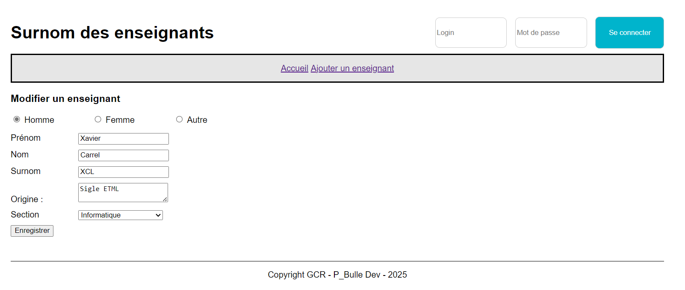

# Application des surnoms des enseignants avec Adonis - Step9

Pour pouvoir modifier un enseignant, nous allons devoir :

- créer deux routes :
  - une route pour afficher le formulaire permettant de renseigner les informations de l'enseignant
  - une route pour gérer l'ajout de l'enseignant
- ajouter deux méthodes au contrôleur
- ajouter une vue

## Routes

Dans le fichier `routes.ts`:

```js
// Route permettant d'afficher le formulaire permettant la mise à jour d'un enseignant
router.get('/teacher/:id/edit', [TeachersController, 'edit']).as('teacher.edit')

// Route permettant la modification de l'enseignant
router.post('/teacher/:id/update', [TeachersController, 'update']).as('teacher.update')
```

## Contrôleur

Dans le contrôleur `teachers_controller.ts` :

```js
   /**
   * Afficher le formulaire permettant la mise à jour d'un enseignant
   */
  async edit({ params, view }: HttpContext) {
    // Sélectionner l'enseignant dont on veut mettre à jour des informations
    const teacher = await Teacher.findOrFail(params.id)

    // Récupération des sections triées par le nom
    const sections = await Section.query().orderBy('name', 'asc')

    // Afficher la vue
    return view.render('pages/teachers/edit.edge', {
      title: 'Modifier un enseignant',
      teacher,
      sections,
    })
  }

  /**
   * Gérer la soumission du formulaire pour la mise à jour d'un enseignant
   */
  async update({ params, request, session, response }: HttpContext) {
    // Validation des données saisies par l'utilisateur
    const { gender, firstname, lastname, nickname, origine, sectionId } =
      await request.validateUsing(teacherValidator)

    // Sélectionner l'enseignant dont on veut mettre à jour des informations
    const teacher = await Teacher.findOrFail(params.id)

    // Si un enseignant correspond à l'id
    if (teacher) {
      // Met à jour les infos de l'enseignant
      await teacher.merge({ gender, firstname, lastname, nickname, origine, sectionId }).save()
    }

    // Afficher un message à l'utilisateur
    session.flash('success', "L'enseignant a été mis à jour avec succès !")

    // Redirige l'utilisateur sur la home
    return response.redirect().toRoute('home')
  }
```

## Ajout de la vue create.edge

Ces composants seront utilisés dans la vue `edit.edge` de cette manière :

```edge
@component('components/layout', { title: title })
  <h3>
    {{ title }}
  </h3>
  <form action="{{ route('teacher.update', {id: teacher.id}) }}" method="post">
    {{ csrfField() }}
    <div class="radio">
      @!component('components/radio', {
      name: 'gender',
      value: old('gender') || (teacher ? teacher.gender : ''),
      options: [
        { value: 'M', label: 'Homme' },
        { value: 'W', label: 'Femme' },
        { value: 'O', label: 'Autre' }
      ]
      })
    </div>

    <div class="field">
      @!component('components/input', { name: 'firstname', label: 'Prénom', value: old('firstname') || (teacher ? teacher.firstname : '') })
    </div>

    <div class="field">
      @!component('components/input', { name: 'lastname', label: 'Nom', value: old('lastname') || (teacher ? teacher.lastname : '') })
    </div>

    <div class="field">
      @!component('components/input', { name: 'nickname', label: 'Surnom', value: old('nickname') || ( teacher ? teacher.nickname : '') })
    </div>

    <div class="field">
      @!component('components/textarea', { name: 'origine', label: 'Origine', value: old('origine') || ( teacher ? teacher.origine : '') })
    </div>

    <div class="field">
      @!component('components/select', {
      name: 'sectionId',
      label: 'Section',
      sections: sections,
      value: old('section') || (teacher ? teacher.sectionId : ''),
      placeholder: 'Choisissez une section'
      })
    </div>

    <button type="submit">Enregistrer</button>
  </form>
@endcomponent
```

## Modifier la vue `home` et la vue `show`

Dans ces 2 deux vues, nous devons mettre à jour le lien pour modifier un enseignant :

```edge
<a href="{{ route('teacher.edit', {id: teacher.id}) }}">
  
</a>
```

## Factorisation du formulaire d'ajout et de modification

Si nous comparons les 2 vues create.edge et edit.edge, il est assez évident que ces 2 vues sont quasiment identiques.

Nous allons donc factoriser le code de ces vues.

Pour cela, nous allons créer un fichier `views/partials/createOrUpdateForm.edge` :

```edge
{{ csrfField() }}
<div class="radio">
  @!component('components/radio', {
      name: 'gender',
      value: old('gender') || (teacher ? teacher.gender : ''),
      options: [
        { value: 'M', label: 'Homme' },
        { value: 'W', label: 'Femme' },
        { value: 'O', label: 'Autre' }
      ]
  })
</div>

<div class="field">
  @!component('components/input', { name: 'firstname', label: 'Prénom', value: old('firstname') || (teacher ? teacher.firstname : '') })
</div>

<div class="field">
  @!component('components/input', { name: 'lastname', label: 'Nom', value: old('lastname') || (teacher ? teacher.lastname : '') })
</div>

<div class="field">
  @!component('components/input', { name: 'nickname', label: 'Surnom', value: old('nickname') || ( teacher ? teacher.nickname : '') })
</div>

<div class="field">
  @!component('components/textarea', { name: 'origine', label: 'Origine', value: old('origine') || ( teacher ? teacher.origine : '') })
</div>

<div class="field">
  @!component('components/select', {
      name: 'sectionId',
      label: 'Section',
      sections: sections,
      value: old('section') || (teacher ? teacher.sectionId : ''),
      placeholder: 'Choisissez une section'
  })
</div>

<button type="submit">Enregistrer</button>
```

et l'utiliser dans les 2 vues.

Vue `create.edge`

```edge
@component('components/layout', { title: title })
  <h3>
    {{ title }}
  </h3>
  <form action="{{ route('teacher.store') }}" method="post">
    @include('partials/createOrUpdateForm')
  </form>
@endcomponent
```

Vue `edit.edge`

```edge
@component('components/layout', { title: title })
  <h3>
    {{ title }}
  </h3>
  <form action="{{ route('teacher.update', {id: teacher.id}) }}" method="post">
    @include('partials/createOrUpdateForm')
  </form>
@endcomponent
```

## Etat de l'application à la fin de cette étape



Dans la prochaine étape <a href="https://github.com/GregLeBarbar/app-teachers-adonisjs/tree/step10">step10</a>, nous allons commencer à mettre en place l'authentification.
